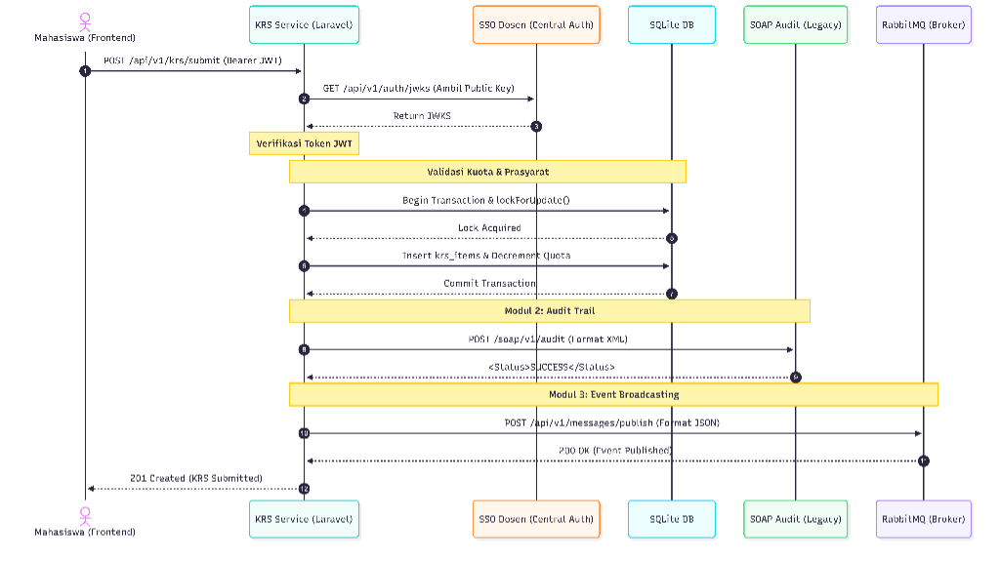

# Analisis Tugas 3: Integrasi Aplikasi Enterprise

## Identitas Mahasiswa
*   **Nama**: Galih Hirpana
*   **NIM**: 102022400068
*   **Kelas**: SI4808
*   **Program Studi**: S1 Sistem Informasi, Telkom University
*   **Layanan**: Service Mata Kuliah & KRS

---

## 1. Justifikasi Transaksi Kritis
Dari semua endpoint yang ada, `POST /api/v1/krs/submit` adalah yang paling kritis di service ini. Ada beberapa alasan kenapa endpoint ini yang dipilih:

*   **Langsung Mengubah Data Utama**: Transaksi ini tidak hanya baca-baca saja — dia benar-benar mengubah `remaining_quota` di tabel `courses` dan menyisipkan kontrak KRS baru ke tabel `krs_items`. Kalau ini gagal di tengah jalan, datanya bisa kacau.
*   **Rawan Race Condition**: Bayangkan ratusan mahasiswa submit KRS di waktu yang sama. Tanpa pengamanan, kuota bisa jadi minus. Makanya transaksi ini pakai *Pessimistic Locking* (`lockForUpdate()`) di dalam Database Transaction supaya tidak ada dua proses yang ngubah data yang sama secara bersamaan.
*   **Memicu Proses di Service Lain**: Kalau transaksi ini sukses, Service Nilai & Kurikulum baru bisa tahu bahwa ada mahasiswa baru yang perlu dibuatkan baris nilai akademiknya. Jadi ini semacam "pintu masuk" dari keseluruhan alur akademik.

---

## 2. Sequence Diagram Interaksi Layanan
Diagram di bawah menunjukkan apa yang sebenarnya terjadi di balik layar saat mahasiswa klik submit KRS — mulai dari validasi token, penguncian database, kirim audit ke sistem lama, sampai broadcast event ke service lain.

### Alur Interaksi:
1. Klien kirim request pengajuan KRS beserta Token JWT.
2. KRS Service ambil Public Key (JWKS) dari SSO Dosen untuk verifikasi token secara lokal — jadi tidak perlu bolak-balik ke server SSO setiap request.
3. Validasi aturan bisnis dijalankan: cek kuota tersisa, lalu kunci baris data di SQLite pakai Pessimistic Locking.
4. Data dikirim ke sistem SOAP Audit dalam format XML yang sudah ditentukan formatnya.
5. Event notifikasi disebarkan ke RabbitMQ Central Exchange supaya service lain bisa bereaksi.
6. Kalau semua langkah di atas berhasil, baru response sukses dikembalikan ke klien.

---

## 3. Capaian Teknis Implementasi (PLO08-CLO03)

### Modul 1: Federated SSO (30%)
*   **Status**: Selesai
*   **Implementasi**: Ada middleware yang tugasnya baca token JWT dari header `Authorization`. Token itu kemudian diverifikasi menggunakan Public Key (JWKS) dengan algoritma RS256 yang diambil langsung dari server dosen di `https://iae-sso.virtualfri.id/api/v1/auth/jwks`. Kalau tokennya palsu atau sudah expired, langsung ditolak dengan 401 — tidak ada negosiasi.

### Modul 2: SOAP XML Client (40%)
*   **Status**: Selesai
*   **Implementasi**: Pencatatan audit dipanggil di dalam `KrsController`, tepat setelah Database Transaction berhasil di-commit. Bagian yang lumayan tricky di sini adalah membangun XML Envelope-nya — data seperti NIM, ID Course, dan status harus dimasukkan ke dalam tag `<TeamID>`, `<ActivityName>`, dan `<LogContent>` dengan isi dibungkus CDATA. Setelah dikirim ke `iae-sso.virtualfri.id/soap/v1/audit`, response dianggap berhasil kalau ada `<Status>SUCCESS</Status>` di dalamnya.

### Modul 3: AMQP Publisher (20%)
*   **Status**: Selesai
*   **Implementasi**: Setelah KRS berhasil disimpan, sistem langsung publish pesan JSON ke endpoint HTTP RabbitMQ di `iae.central.exchange` dengan routing key `krs.submitted.event`. Ini yang nantinya ditangkap oleh Service Nilai & Kurikulum. Prosesnya tidak blocking, jadi tidak memperlambat response ke pengguna.

### Modul 4: Akuntabilitas & Progres (10%)
*   **Status**: Selesai
*   **Implementasi**: Semua proses pengerjaan — termasuk beberapa dead-end waktu debugging format XML yang ternyata harus pakai CDATA — sudah didokumentasikan di file log prompt engineering AI yang ada di repository ini.