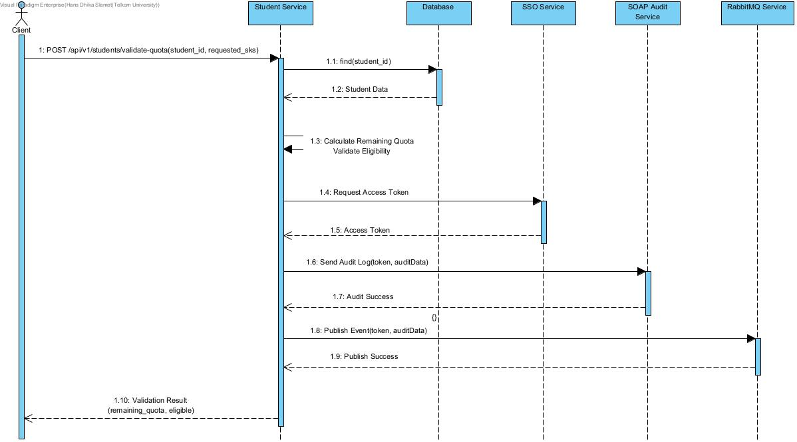

# Analisis Tugas 3 – Data Mahasiswa Service

## 1. Analisis Transaksi Penting dan Penyebaran Informasi

### A. Transaksi Penting (SOAP Audit Service)

Pada layanan Data Mahasiswa Service, transaksi yang dianggap penting adalah proses **validasi kuota SKS mahasiswa** melalui endpoint:

```http
POST /api/v1/students/validate-quota
```

Transaksi ini dikategorikan sebagai transaksi penting karena:

1. Berhubungan langsung dengan proses akademik mahasiswa.
2. Menentukan apakah mahasiswa masih memiliki kuota SKS yang mencukupi untuk mengambil mata kuliah.
3. Memerlukan pencatatan aktivitas (audit trail) untuk keperluan monitoring dan pelacakan transaksi.
4. Dapat digunakan sebagai bukti bahwa suatu proses validasi pernah dilakukan oleh sistem.

Oleh karena itu, setelah proses validasi berhasil dilakukan, layanan akan mengirimkan data transaksi ke layanan Audit Terpusat menggunakan protokol SOAP melalui `SoapAuditService`.

Data yang dikirimkan meliputi:

* Student ID
* NIM Mahasiswa
* Jumlah SKS yang diminta
* Sisa kuota SKS
* Status kelayakan pengambilan SKS

Dengan mekanisme ini, setiap transaksi penting akan tercatat pada sistem audit terpusat.

---

### B. Transaksi Penyebaran Informasi (RabbitMQ)

Selain dicatat sebagai audit, hasil validasi kuota SKS juga perlu disebarkan kepada sistem lain yang mungkin membutuhkan informasi tersebut.

Untuk itu digunakan RabbitMQ melalui `RabbitMQService`.

Informasi yang dipublikasikan meliputi:

* Student ID
* NIM Mahasiswa
* Requested SKS
* Remaining Quota
* Eligibility Status

Penggunaan RabbitMQ dipilih karena:

1. Mendukung komunikasi asynchronous.
2. Mengurangi ketergantungan langsung antar layanan.
3. Memungkinkan layanan lain menerima informasi tanpa mengubah Data Mahasiswa Service.
4. Mendukung arsitektur event-driven pada lingkungan microservices.

Dengan demikian, setiap hasil validasi kuota dapat dikonsumsi oleh layanan lain yang berlangganan pada message broker yang sama.

---

## 2. Sequence Diagram Internal

### A. Sequence Diagram Validasi Kuota dengan Integrasi SSO, SOAP, dan RabbitMQ

Aktor:

* Client
* Student Service
* Database Mahasiswa
* SSO Service (IAE)
* SOAP Audit Service
* RabbitMQ Service

Alur proses:

1. Client mengirim request validasi kuota SKS.
2. Student Service mengambil data mahasiswa dari database.
3. Student Service menghitung sisa kuota SKS dan menentukan status eligibility.
4. Student Service meminta Access Token ke SSO Service.
5. SSO Service mengembalikan Access Token.
6. Student Service mengirim data audit ke SOAP Audit Service.
7. SOAP Audit Service mengembalikan status audit berhasil.
8. Student Service mempublikasikan event ke RabbitMQ Service.
9. RabbitMQ Service mengembalikan status publish berhasil.
10. Student Service mengirim response hasil validasi kepada client.

Representasi Sequence Diagram:



Sequence diagram tersebut menunjukkan bahwa Student Service bertindak sebagai orchestration service yang mengintegrasikan proses validasi mahasiswa dengan layanan terpusat yang disediakan oleh dosen, yaitu SSO Service, SOAP Audit Service, dan RabbitMQ Service.
