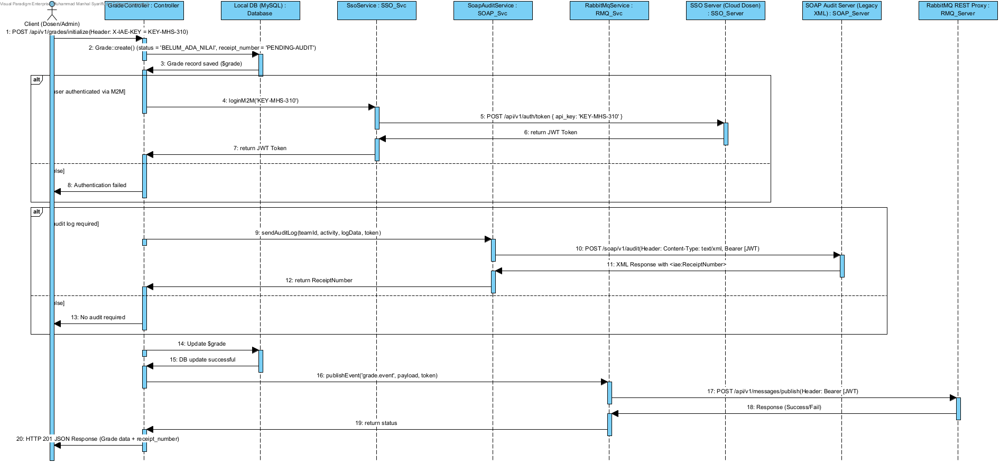

# Analisis Service 3 - Nilai dan Kurikulum

## Identitas

* Nama : Muhammad Manhal Syariffudin
* NIM : 102022400285
* Service : Nilai dan Kurikulum

---

# Deskripsi Layanan

Service Nilai dan Kurikulum merupakan REST API yang digunakan untuk menyediakan informasi transkrip nilai prasyarat serta aturan kurikulum mahasiswa. Service ini memungkinkan sistem lain (seperti KRS Service) untuk memverifikasi kelayakan kelulusan mata kuliah prasyarat sebelum mahasiswa dapat melakukan registrasi rencana studi baru.

Service dikembangkan menggunakan framework Laravel, didokumentasikan menggunakan OpenAPI/Swagger, serta terintegrasi secara synchronous dan asynchronous dengan infrastruktur pusat.

---

# Analisis Kebutuhan

Berdasarkan kontrak integrasi yang diberikan, Service Nilai dan Kurikulum harus menyediakan beberapa endpoint utama:

1. Mendapatkan seluruh aturan prasyarat kurikulum.
2. Mendapatkan detail riwayat nilai/transkrip mahasiswa berdasarkan NIM (student_id).
3. Menginisialisasi baris data nilai baru untuk mahasiswa (Transaksi Kritis).
4. Menggunakan API Key M2M (`KEY-MHS-310`) dan Federated SSO sebagai mekanisme autentikasi.
5. Mendukung integrasi SOAP Audit Service untuk pencatatan log transaksi kritis secara aman.
6. Mendukung integrasi RabbitMQ untuk menyebarkan event notifikasi secara asynchronous ke seluruh departemen.

---

# Analisis Endpoint

## GET /api/v1/curriculums

### Tujuan

Mengambil seluruh aturan prasyarat kurikulum program studi untuk mendeteksi keterikatan antar mata kuliah.

### Input

Tidak memerlukan parameter body. Menggunakan header autentikasi `X-IAE-KEY`.

### Output

Daftar aturan prasyarat kurikulum dalam format JSON.

### Status Code

* 200 OK

---

## GET /api/v1/grades/{student_id}

### Tujuan

Mengambil detail riwayat transkrip nilai mahasiswa berdasarkan ID/NIM untuk pembuktian kelulusan mata kuliah prasyarat.

### Input

Parameter `student_id` (NIM mahasiswa) pada path URL.

### Output

Daftar data record nilai mahasiswa yang sesuai dalam format JSON.

### Status Code

* 200 OK
* 404 Grade records not found for student ID

---

## POST /api/v1/grades/initialize

### Tujuan

Menginisialisasi baris data nilai baru untuk mahasiswa sebagai transaksi kritis awal sebelum pengisian nilai akhir dilakukan.

### Proses

1. Request inisialisasi diterima oleh GradeController.
2. Sistem memetakan role lokal user dari token SSO untuk memastikan hak akses wewenang.
3. Sistem menyimpan status awal `'BELUM_ADA_NILAI'` ke database lokal MySQL.
4. Sistem melakukan pertukaran token M2M JWT ke SSO Pusat menggunakan API Key (`KEY-MHS-310`).
5. Sistem melakukan pencatatan log audit dalam format XML kaku ke SOAP Audit terpusat menggunakan SoapAuditService.
6. Sistem menangkap `<iae:ReceiptNumber>` hasil respons SOAP server menggunakan Regex dan menyimpannya di DB lokal.
7. Sistem mengirim event notifikasi JSON ke RabbitMQ menggunakan REST Proxy RabbitMqService.
8. Sistem mengembalikan respons sukses.

### Status Code

* 201 Created
* 401 Unauthorized (Invalid API Key)

---

# Analisis Arsitektur

Sistem menggunakan pendekatan REST API dengan komponen sebagai berikut:

### Client

Mengirim request ke endpoint API (seperti KRS Service atau Admin Panel Dosen).

### API Gateway / Middleware

Middleware `iae.auth` (`CheckIaeKey`) digunakan untuk memvalidasi akses klien menggunakan API Key dan memetakan hak wewenang.

### Controller

GradeController bertanggung jawab menerima request, mengorkestrasi logika bisnis 3-lapis, dan mengembalikan response terstandardisasi.

### Service Layer

Terdiri dari:

* SsoService (Otorisasi M2M JWT terpusat)
* SoapAuditService (Log Audit XML)
* RabbitMqService (Publish message AMQP)

Service layer digunakan untuk memisahkan logika integrasi sistem eksternal dari core controller.

---

# Integrasi SOAP Audit Service

SOAP Audit Service digunakan untuk mencatat aktivitas log ketika terjadi transaksi kritis berupa inisialisasi nilai baru mahasiswa.

Implementasi dilakukan melalui:

```php
SoapAuditService::sendAuditLog($teamId, $activityName, array $logData, $token);
```

Tujuan integrasi ini adalah memastikan setiap aktivitas bernilai hukum/akademis kritis dapat diaudit secara sah oleh server pusat, menghasilkan `ReceiptNumber` yang di-update ke DB lokal.

---

# Integrasi RabbitMQ

RabbitMQ digunakan untuk mengirimkan event notifikasi ke seluruh sistem departemen secara asynchronous ketika data nilai berhasil diinisialisasi.

Implementasi dilakukan melalui:

```php
RabbitMqService::publishEvent($routingKey, array $payload, $token);
```

Event yang dikirim ke exchange `iae.central.exchange` dengan routing key `grade.event`:

```json
{
    "event": "grade.initialized",
    "team_id": "TEAM-09",
    "student_id": "102022400285",
    "course_code": "SI4808",
    "receipt_number": "RECEIPT-SOAP-XX",
    "timestamp": "2026-06-20T00:45:00+07:00"
}
```

Tujuan penggunaan RabbitMQ adalah mendukung integrasi asinkronus (Event-Driven Architecture) antarlayanan demi skalabilitas sistem.

---

# Sequence Diagram




---

# Kesimpulan

Service Nilai dan Kurikulum telah berhasil menyediakan endpoint sesuai kebutuhan integrasi dan kriteria tugas. Service mendukung autentikasi menggunakan API Key dan Federated SSO, dokumentasi Swagger/OpenAPI, integrasi SOAP Audit Service untuk keabsahan transaksi kritis, serta RabbitMQ untuk pengiriman event log terdistribusi. Dengan implementasi tersebut, service telah memenuhi standar arsitektur Enterprise Application Integration (EAI).
