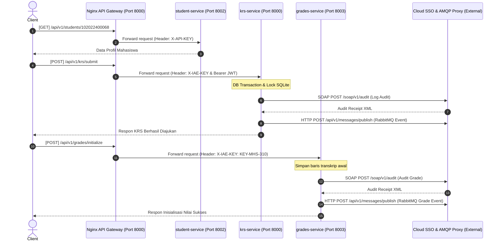

# Monorepo TEAM-09: Persetujuan Pengambilan KRS

Repositori ini menyatukan 3 microservices yang berkolaborasi dalam proses bisnis persetujuan dan pengambilan rencana studi mahasiswa (KRS) di bawah satu Nginx API Gateway terpadu.

---

## 📂 Struktur Project Monorepo

```text
TUBES-IAE_TEAM-09/
├── 102022400068_krs-service/          ← Service Mata Kuliah & KRS (Galih Hirpana)
├── 102022400280_Data_Mahasiswa_Service/ ← Service Data Mahasiswa (D Hans Dhika Slamet)
├── 102022400285_grades-service/       ← Service Nilai & Kurikulum (Muhammad Manhal Syarifudin)
├── api-gateway/                       ← Konfigurasi & Dockerfile Nginx API Gateway
├── docker-compose.yml                 ← Konfigurasi orchestration Docker Compose
├── LOG_PROMPTING.md                   ← Log Prompting Integrasi Monorepo
├── RESUME_KONTRIBUSI.md               ← Resume kontribusi pengerjaan kelompok & individu
└── README.md                          ← Dokumen panduan utama ini
```

---

## 🏗️ Arsitektur Sistem & Port Mapping

Dalam arsitektur microservices ini, seluruh request eksternal (Postman, Frontend, Swagger) diarahkan ke **Nginx API Gateway** sebagai pintu masuk utama tunggal. Nginx kemudian meneruskan request tersebut secara internal ke microservices tujuan.

| Service Name Docker | Host Port (Laptop) | Container Port | Developer | Fungsi Utama |
| :--- | :--- | :--- | :--- | :--- |
| `api-gateway` | `8000` | `80` | Team-09 | Pintu masuk utama & proxy reverse router |
| `krs-service` | `8001` | `8000` | Galih Hirpana | Mengelola mata kuliah & submit draft KRS |
| `student-service` | `8002` | `8000` | D Hans Dhika Slamet | Mengelola data profil & keaktifan mahasiswa |
| `grades-service` | `8003` | `8000` | M. Manhal Syarifudin | Mengelola prasyarat nilai & kurikulum |

---

## 🚀 Cara Menjalankan Sistem (Local Setup)

Untuk menjalankan seluruh layanan microservices secara bersamaan di dalam jaringan Docker lokal:

1. Pastikan Docker Desktop telah berjalan di komputer Anda.
2. Buka terminal (Git Bash, cmd, atau PowerShell) di direktori utama repositori:
   ```bash
   cd TUBES-IAE_TEAM-09
   ```
3. Jalankan command Docker Compose berikut untuk mem-build dan menyalakan semua container di latar belakang:
   ```bash
   docker compose up -d --build
   ```
4. Periksa apakah semua container telah aktif dan berjalan:
   ```bash
   docker compose ps
   ```

---

## 🧪 Panduan Pengujian E2E Core Business Flow

Gunakan skenario pengujian di bawah ini untuk memverifikasi fungsionalitas alur bisnis secara berurutan. Seluruh perintah cURL **harus menggunakan host `http://localhost:8000`** (Nginx API Gateway).

> [!IMPORTANT]
> **CATATAN AUTHENTICATION:**
> Bagian `<TOKEN_M2M>` pada Langkah 2 harus diganti dengan JWT token asli yang valid. Anda dapat memperoleh token asli tersebut dengan melakukan request token ke SSO Dosen (`https://iae-sso.virtualfri.id/api/v1/auth/token`) menggunakan API Key kelompok atau credentials warga kelompok 9.

### Langkah 1: Cek Profil Mahasiswa (`student-service`)
Mengambil data master profil mahasiswa berdasarkan NIM untuk memastikan keaktifan mahasiswa sebelum pendaftaran KRS.
```bash
curl --location --request GET 'http://localhost:8000/api/v1/students/102022400068' \
--header 'X-IAE-KEY: 102022400068' \
--header 'X-API-KEY: 102022400280' \
--header 'Accept: application/json' \
--header 'Content-Type: application/json'
```

### Langkah 2: Pengajuan KRS Mahasiswa (`krs-service`)
Melakukan pendaftaran mata kuliah mahasiswa secara aman menggunakan Database Transaction & Pessimistic Locking.
```bash
curl --location --request POST 'http://localhost:8000/api/v1/krs/submit' \
--header 'X-IAE-KEY: 102022400068' \
--header 'Authorization: Bearer <TOKEN_M2M>' \
--header 'Accept: application/json' \
--header 'Content-Type: application/json' \
--data-raw '{
    "student_id": "102022400068",
    "course_id": 1
}'
```

### Langkah 3: Inisialisasi Transkrip Nilai Akademik (`grades-service`)
Menginisialisasi baris transkrip nilai kosong berstatus `BELUM_ADA_NILAI` untuk mata kuliah yang telah diajukan.
```bash
curl --location --request POST 'http://localhost:8000/api/v1/grades/initialize' \
--header 'X-IAE-KEY: KEY-MHS-310' \
--header 'Accept: application/json' \
--header 'Content-Type: application/json' \
--data-raw '{
    "student_id": "102022400068",
    "course_id": "IF-101"
}'
```

---

## 📊 Diagram Alir Data (Sequence Diagram)

Diagram berikut menggambarkan secara visual jalannya data ketika client mengeksekusi E2E flow di atas melalui Nginx API Gateway:


